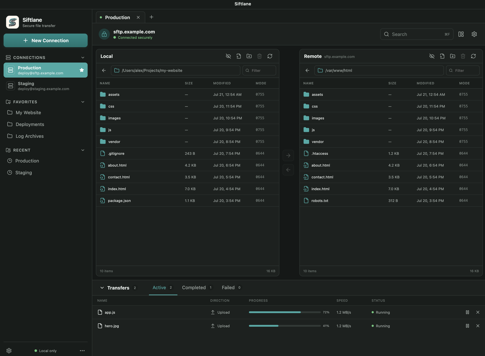

# Siftlane — File Transfer Client for macOS, Windows, and Linux

Siftlane is a lightweight, open-source file transfer client for macOS, Windows, and Linux. Built with Rust, Tauri 2, TypeScript, and React, it supports SFTP, FTP, and explicit FTPS connections with saved profiles and resumable uploads and downloads.

The interface is designed around a quiet dual-pane workflow with no advertising or upgrade popups. Siftlane is currently in early alpha and is intended for development and evaluation while the cross-platform desktop SFTP experience matures.



> **Project status:** early alpha. SFTP, FTP, and explicit FTPS are implemented for development and evaluation. Recursive directory transfers, remote search, bookmarks, and implicit FTPS remain roadmap items.

## Features

- SFTP password, private-key, and SSH-agent authentication through `russh`
- FTP and explicit FTPS password or anonymous authentication
- Unknown and changed host-key confirmation with SHA-256 fingerprints
- Connection profiles in SQLite; passwords/passphrases only in the OS keyring
- Local/remote dual-pane browser with remote-focused mode
- Upload/download queue with progress, pause, cancel, retry, conflict prompts, partial files, and restart recovery
- Remote create, rename, delete, and POSIX permission operations
- Explicit sudo editing for protected local Unix files and SFTP files
- Persistent preferences, window state, transfer history, and recent connections
- Native macOS, Windows, and Linux packaging configuration
- Signed in-app updates from GitHub Releases (Tauri updater; no Apple Developer account required)
- Browser demo mode for fast UI work without a running Tauri backend

## Project structure

Siftlane is a Cargo workspace with a Tauri desktop shell and a React frontend. Protocol-independent transfer logic lives in reusable Rust crates, while native persistence and IPC commands stay in the Tauri application layer.

```text
.
├── crates/
│   ├── siftlane-core/       # Shared models, errors, filesystem traits, and transfer state machine
│   ├── siftlane-sftp/       # russh/russh-sftp implementation and SSH host-key verification
│   └── siftlane-ftp/        # FTP and explicit FTPS implementation
├── src/                     # React UI, Zustand store, typed IPC client, and browser demo
│   ├── lib/
│   └── test/
├── src-tauri/               # Tauri commands, SQLite storage, keyring, sessions, and transfers
│   ├── capabilities/
│   └── src/
├── docs/                    # Architecture, threat model, and screenshots
├── index.html               # Vite entry document
├── package.json             # Frontend and desktop development scripts
├── Cargo.toml               # Rust workspace and shared dependency versions
├── vite.config.ts           # Vite configuration
└── tsconfig*.json           # TypeScript project configuration
```

Key boundaries:

- `crates/siftlane-core` contains transport-neutral domain logic so future protocols can reuse the transfer queue.
- `crates/siftlane-sftp` and `crates/siftlane-ftp` adapt the core filesystem interface to their respective protocols.
- `src-tauri` exposes native functionality through Tauri IPC and handles SQLite, OS keyring access, sessions, and transfer execution.
- `src` renders the desktop UI and provides a browser-only demo adapter for fast frontend work.

## Development

Prerequisites:

- Rust stable (MSRV 1.88)
- Node.js 22 or newer
- pnpm 11
- The [Tauri system prerequisites](https://v2.tauri.app/start/prerequisites/) for your OS

```sh
npm install
npm run tauri dev
```

For frontend-only development, run `npm run dev`. It starts in the same empty first-run state as a fresh desktop install. Run `npm run dev:demo` (or open `/?demo=1`) when you intentionally want the populated UI showcase. Browser connections are simulated; use `npm run tauri dev` to exercise real SFTP and native persistence.

## Quality checks

```sh
npm run build
npm test
cargo fmt --all -- --check
cargo clippy --workspace --all-targets -- -D warnings
cargo test --workspace
```

## Security and architecture

- `crates/siftlane-core`: protocol-neutral models, errors, filesystem trait, and transfer state machine
- `crates/siftlane-sftp`: `russh`/`russh-sftp` adapter and strict host-key verification
- `src-tauri`: commands, SQLite persistence, OS keyring integration, sessions, and transfer runner
- `src`: React UI, Zustand state, typed IPC boundary, and browser demo adapter

SQLite never stores credentials. Keyring entries use the service name `app.siftlane.desktop`, keyed by connection UUID. Uploads and downloads first write uniquely named partial files and use a backup/rename commit sequence to reduce the chance of replacing a destination with incomplete data.

### macOS development Keychain access

The macOS Keychain associates an item's access rule with the code signature of the executable that created it. An ad-hoc Rust development build receives a new signature hash after every rebuild, which makes Keychain ask for the login password again. `npm run tauri dev` now signs the Siftlane debug executable with the first available **Apple Development** signing identity, or a local **Siftlane Development** identity, so the rule remains stable across rebuilds. Set `SIFTLANE_DEV_SIGNING_IDENTITY` to a specific identity or certificate hash when more than one is available.

The first access after enabling this may still require one confirmation. Choose **Always Allow**. Existing credentials created by ad-hoc builds can retain their old hash-based rules; delete only the affected `app.siftlane.desktop` entry in Keychain Access and save that connection password again to recreate it with the stable rule.

Touch ID is not available through the legacy macOS Keychain API used by development builds. It requires the protected-data Keychain plus a provisioned, sandboxed macOS application. Until the release signing/provisioning setup is in place, the secure expected experience is no prompt after the one-time **Always Allow**, rather than a Touch ID prompt on every connection.

If you do not have a paid Apple Developer account, create a local signing identity in **Keychain Access → Certificate Assistant → Create a Certificate…**. Name it `Siftlane Development`, choose **Self-Signed Root Certificate**, choose **Code Signing** as the certificate type, and keep the generated private key in your login keychain. Then double-click the certificate under **login → My Certificates**, expand **Trust**, set **Code Signing** to **Always Trust**, and close the dialog (approve with your Mac password if asked). Verify it with `security find-identity -v -p codesigning`, then run `npm run tauri dev`. If it is not selected automatically, set `SIFTLANE_DEV_SIGNING_IDENTITY` to the certificate hash printed by that command.

Protected-file operations use the existing SSH identity (including private keys and SSH agents) for connection authentication, then check the remote account's sudo policy separately. Siftlane probes `sudo -n` for `NOPASSWD` access and otherwise prompts for the account's sudo password for the immediate read, write, create, or delete operation; it never stores or logs that password. A terminal that does not prompt may be using a cached sudo timestamp, which is not shared with Siftlane's non-interactive SSH channel. Server administrators must configure an appropriate `NOPASSWD` policy when passwordless file operations are required.

See [CONTRIBUTING.md](CONTRIBUTING.md), [SECURITY.md](SECURITY.md), and [docs/architecture.md](docs/architecture.md) for more detail.

## License

Licensed under either of Apache License 2.0 or MIT, at your option.
