# Siftlane — File Transfer Client for macOS, Windows, and Linux

Siftlane is a lightweight, open-source file transfer client for macOS, Windows, and Linux. Built with Rust, Tauri 2, TypeScript, and React, it supports SFTP, FTP, and explicit FTPS connections with saved profiles and resumable uploads and downloads.

The interface is designed around a quiet dual-pane workflow with no advertising or upgrade popups. Siftlane is currently in early alpha and is intended for development and evaluation while the cross-platform desktop SFTP experience matures.

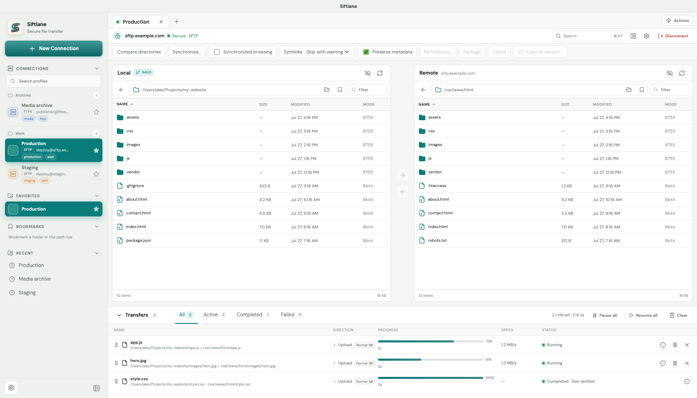

> **Project status:** early alpha. SFTP, FTP, and explicit FTPS are implemented for development and
> evaluation. Native file drops, external editing, profile portability, enterprise SSH routing,
> and streamed remote-to-remote file copies are available. Implicit FTPS and server-side
> remote-to-remote copy remain roadmap items.

## Features

- SFTP password, private-key, and SSH-agent authentication through `russh`
- FTP and explicit FTPS password or anonymous authentication
- Unknown and changed host-key confirmation with SHA-256 fingerprints
- Single-hop ProxyJump through saved SFTP bastion profiles, plus SOCKS5 and HTTP CONNECT routing
- Deny-by-default SSH agent forwarding and ordered key-exchange, host-key, cipher, and MAC policies
- OpenSSH `known_hosts` import and auditable trusted-key management with first/last-seen timestamps
- Searchable connection profiles with folders, tags, colors, notes, and credentials kept only in
  the OS keyring
- Versioned JSON export/import for profiles, bookmarks, and saved actions; secrets are excluded by
  default and available only through an explicit encrypted export
- Connection profiles in SQLite; passwords/passphrases only in the OS keyring
- Local/remote dual-pane browser with remote-focused mode
- Native Finder/Explorer file drops onto the remote pane, including folder targets and recursive
  upload planning
- External-editor workflow for remote text files with private temporary copies, save watching,
  side-by-side diff review, and confirmed atomic upload
- Paired-directory comparison by name, size, and modification time, with visual local-only,
  remote-only, newer, and size-mismatch markers
- Reviewed upload-mirror, download-mirror, and newest-wins two-way synchronization
- Per-profile synchronized browsing roots with a visible warning when the paired path is missing
- Cmd/Ctrl multi-select, Shift range selection, Select All, keyboard navigation, aggregate sizes,
  and batch transfer, delete, permission, and packaging operations
- Recursive local and remote filename search from the session header
- Upload/download queue with progress, pause, cancel, bounded automatic retry, conflict prompts,
  Keep Both, partial files, restart recovery, integrity verification, and recursive directory transfers
- Remote-to-remote regular-file copies between two open sessions, streamed through the client with
  bounded memory, explicit routing, resumable partials, integrity verification, and atomic commits
- Queue-wide pause/resume, transfer priorities, drag ordering, per-job and overall ETA, remaining
  bytes, and a detail drawer with timestamps, retry history, partial paths, and errors
- Global and per-profile upload/download rate limits, reusable time schedules, and temporary
  one-hour overrides backed by shared token buckets
- Explicit symbolic-link policies (skip with warning, copy link, or dereference) and optional
  permission/modification-time preservation where the destination supports it
- Restored tabs, paths, layout, and active session on launch, with an opt-out and support for
  opening the same profile in multiple tabs
- Remote create, rename, delete, and POSIX permission operations
- Explicit sudo editing for protected local Unix files and SFTP files
- Persistent preferences, window state, transfer history, and recent connections
- Native macOS, Windows, and Linux packaging configuration
- Signed in-app updates from GitHub Releases (Tauri updater; no Apple Developer account required)
- Browser demo mode for fast UI work without a running Tauri backend

## Native desktop file workflow

Drop files or directories from Finder, Explorer, or a Linux file manager onto the remote pane.
Siftlane highlights the resolved remote folder before accepting the drop, then sends files through
the normal conflict-aware transfer queue. Directories use the existing bounded recursive planner,
so native drops retain pause, retry, integrity-verification, and conflict behavior.

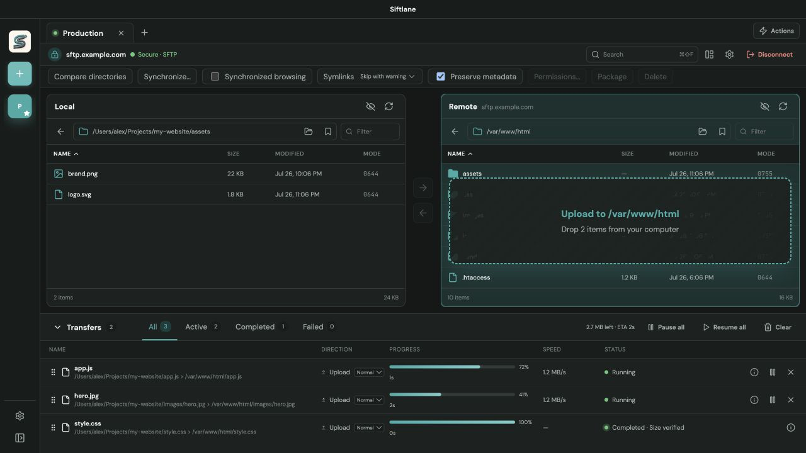

For a remote UTF-8 text file, choose **Edit in external editor** from its context menu. Siftlane:

1. downloads the file into a randomly named, app-owned temporary directory;
2. applies private directory/file permissions on Unix and opens the copy with the OS default editor;
3. watches the working copy for saves and shows the remote and saved versions side by side;
4. uploads only after confirmation, using a synchronized temporary remote file and atomic rename;
5. removes an edit's temporary directory when the session ends, and removes the entire temporary
   root automatically when Siftlane exits.

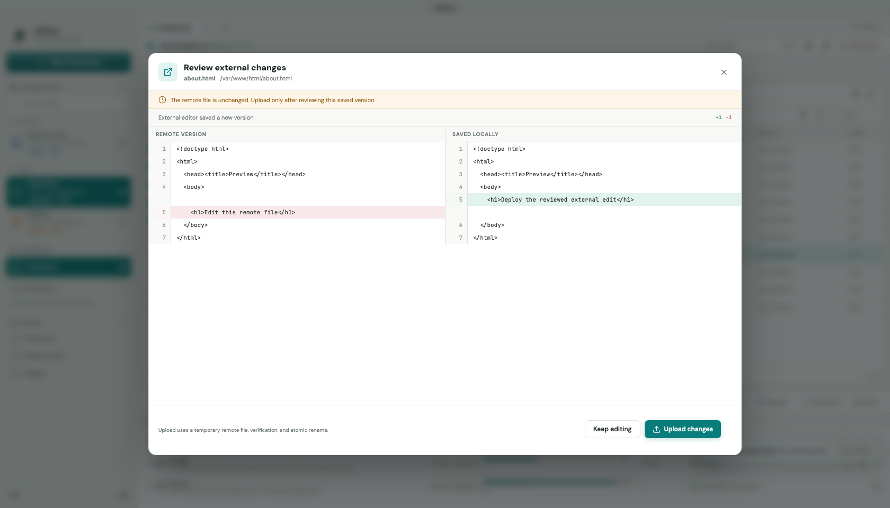

## Remote-to-remote transfers

Select one or more regular files in a remote pane and choose **Copy to session…**. The route review
names both open sessions and every source/destination path before anything is queued. Choose how
destination conflicts should be handled, then start the copy without creating a manually managed
local download.

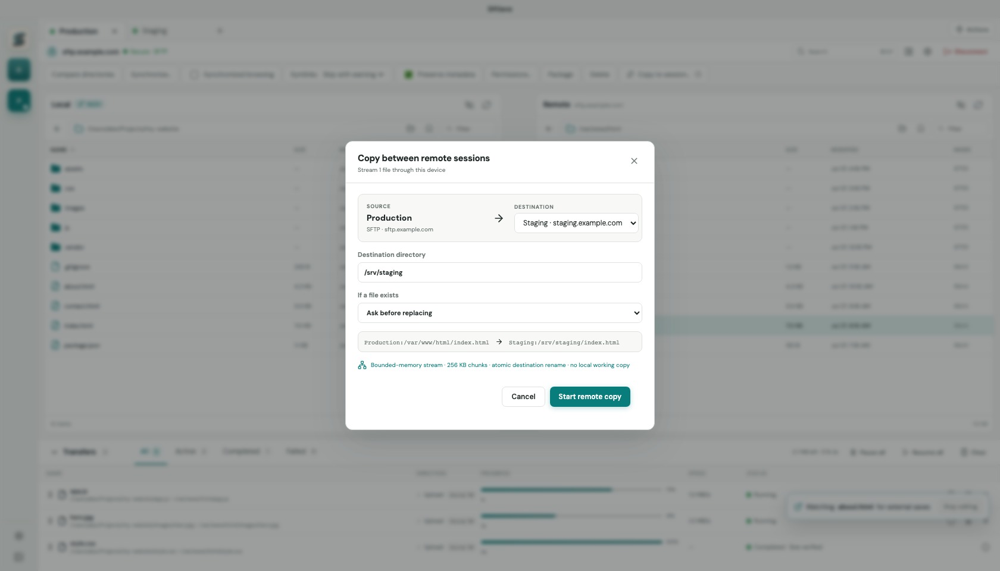

The initial implementation streams through the desktop client in chunks no larger than 256 KB, so
memory use stays bounded regardless of file size. Interrupted copies resume from a uniquely named
destination partial. Siftlane verifies the resulting size (and SHA-256 for files up to 64 MB) before
an atomic rename; overwrite uses the same backup-and-rename safety sequence as uploads. The queue
keeps the source and destination endpoints visible throughout the transfer.

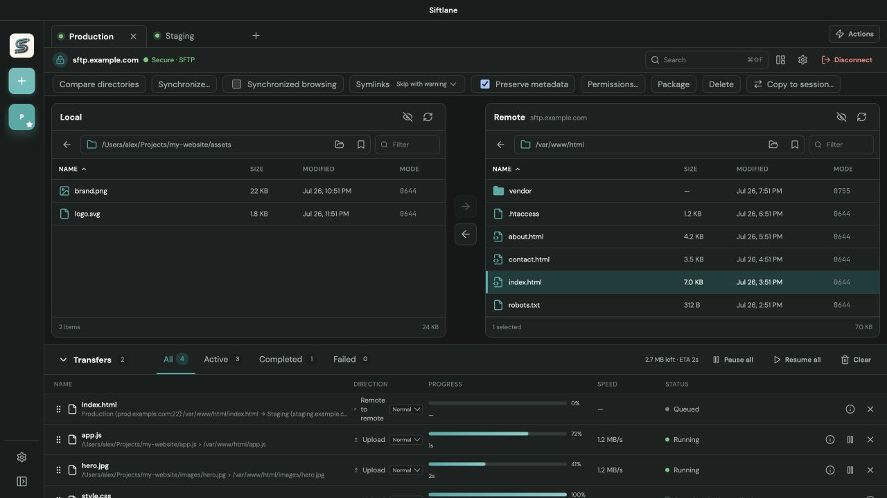

## Synchronization and queue workflows

Comparison mode evaluates the two currently open directories. It matches entries by name and then
compares type, size, and modification time. Differences are marked in both panes without changing
either filesystem.

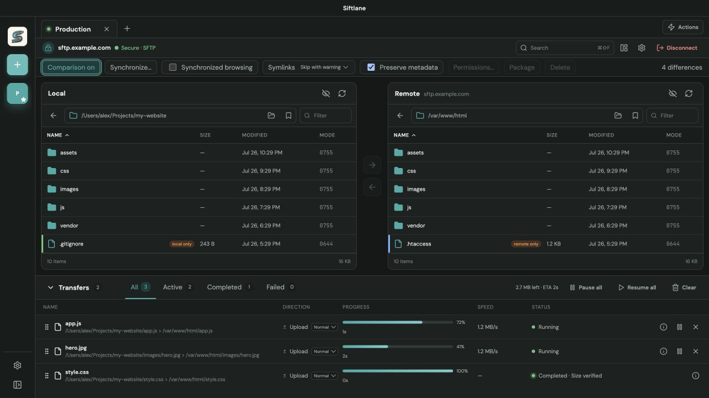

Choosing **Synchronize…** always opens a review checklist. Every proposed transfer or deletion is
shown before execution, and individual actions can be excluded. The available modes are:

- **Two-way:** local-only and remote-only entries are copied across; the newer version wins when
  both sides differ.
- **Upload mirror:** local is authoritative; remote-only entries become reviewed deletions.
- **Download mirror:** remote is authoritative; local-only entries become reviewed deletions.

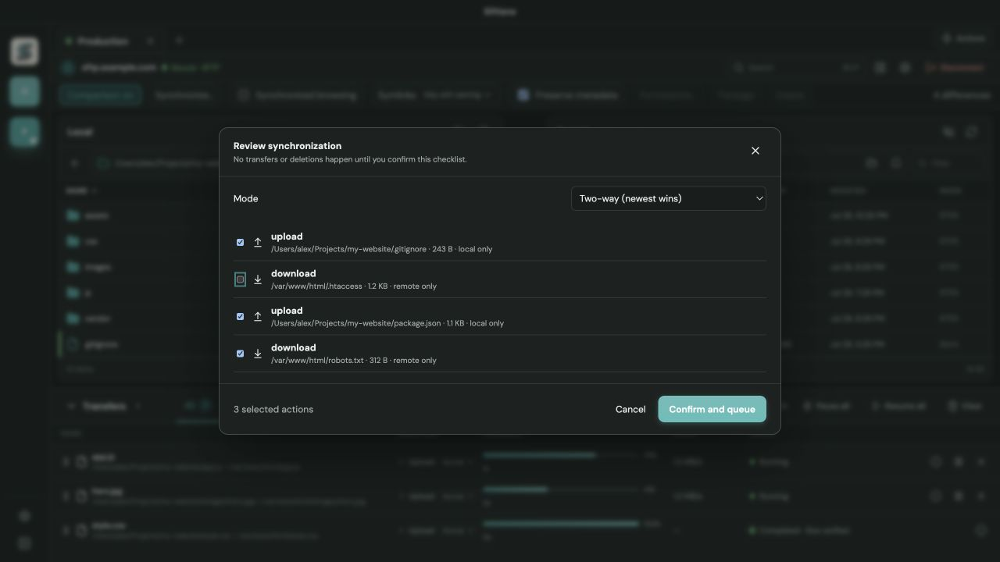

Turn on **Synchronized browsing** to store the current local and remote directories as the root pair
for that profile. Navigating below either root follows the same relative path in the other pane. If
the paired directory is absent, Siftlane leaves that pane in place and displays the missing path.

File panes support Cmd/Ctrl-click, Shift-click, Cmd/Ctrl+A, arrow/Home/End navigation, and Enter to
open the focused item. Batch controls use the focused pane, while the footer reports the selection
count and aggregate known size.

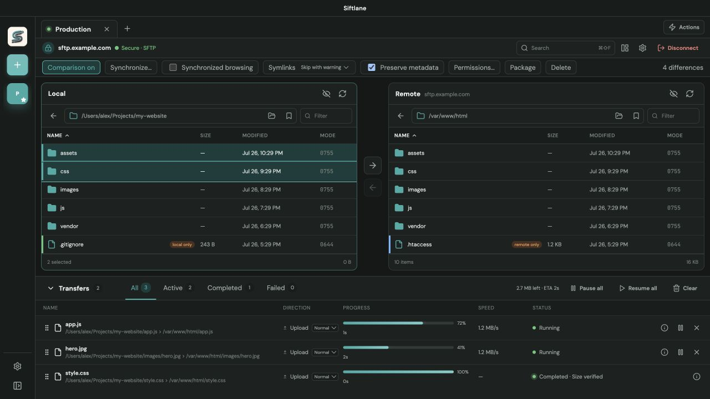

Transfer rows expose priority and drag ordering alongside per-job ETA. **Pause all** and **Resume
all** act across the queue, while the detail drawer shows persisted diagnostic information.

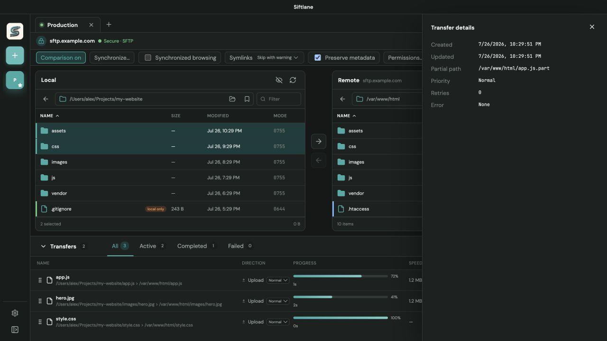

## Transfer policies and bandwidth

The transfer toolbar offers three symbolic-link policies:

- **Skip with warning:** omit links and report how many were skipped.
- **Copy link:** preserve the link itself when supported. SFTP and local Unix destinations support
  link creation; unsupported protocols return an explicit error.
- **Dereference:** transfer the linked file or local directory contents. Remote links that cannot be
  resolved safely are rejected instead of being silently followed.

With **Preserve metadata** enabled, downloads restore modification times and POSIX permissions when
reported by the server. Uploads restore POSIX permissions when the remote protocol advertises
`chmod` support.

Transfer settings accept shared global limits and profile-specific upload/download limits in KB/s.
Reusable local-time schedules can override the global rate—for example, an overnight unlimited
window—and a configured global rate can be activated temporarily for one hour.

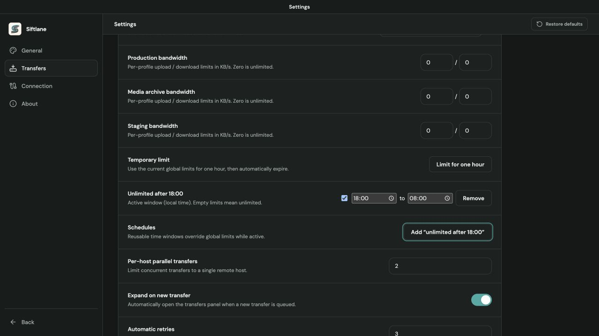

## Enterprise SSH connectivity

SFTP profiles can route through a saved SFTP profile as a single ProxyJump bastion. Siftlane opens
an SSH `direct-tcpip` channel from the authenticated bastion to the destination and verifies both
servers against the same local trust store. Nested jumps are rejected deliberately. A SOCKS5 or
HTTP CONNECT proxy can be used for the direct connection—or to reach the bastion when both options
are configured. Proxy authentication is not yet supported.

Agent forwarding is denied by default. When explicitly enabled for a profile, remote command
channels can reach only the user's running local SSH agent; private-key material still never enters
Siftlane. Profiles may also replace the safe `russh` defaults with ordered allowlists for key
exchange, host-key, cipher, and MAC algorithms. Unsupported names fail before a network connection
is attempted.

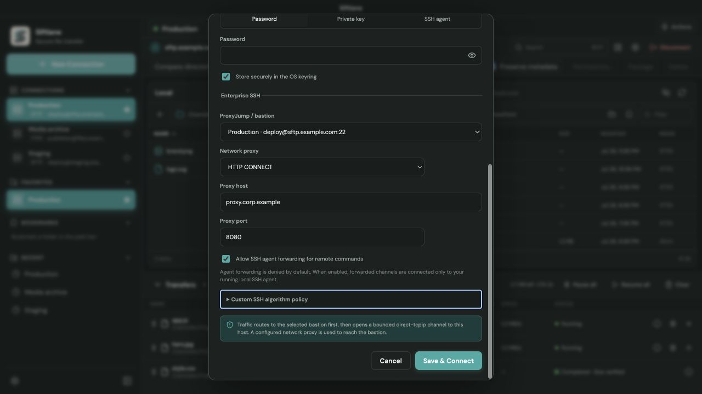

**Settings → Trusted hosts** lists every trusted SHA-256 fingerprint with its first-seen and
last-seen timestamps. OpenSSH `known_hosts` files can be imported; concrete hostnames and
`[host]:port` entries are supported, while hashed hosts, wildcard patterns, revocations, and
certificate-authority markers are reported as skipped. Removing trust requires a separate
confirmation before the record is deleted.

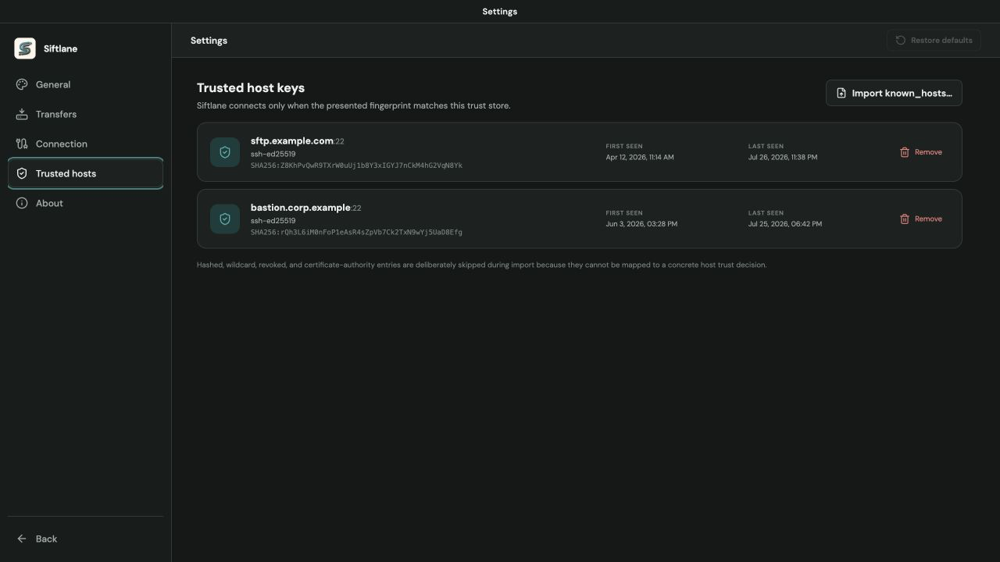

## Profile organization and portable configuration

Connection profiles can be grouped into folders, identified with a color, labeled with reusable
tags, and annotated with private operator notes. Search matches the profile name, host, username,
folder, tags, and notes without changing the saved organization.

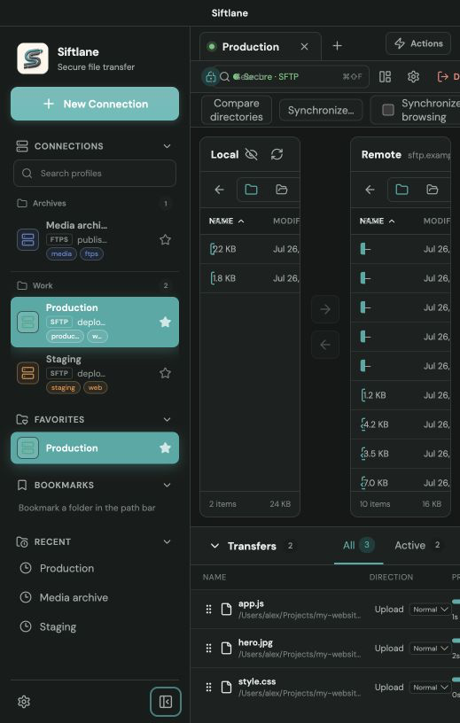

**Settings → Profiles & data** exports profiles, bookmarks, and saved actions as
`app.siftlane.configuration` JSON. The document carries a schema version so future Siftlane
releases can migrate it deliberately; imports are previewed and validated before records are
merged by stable ID.

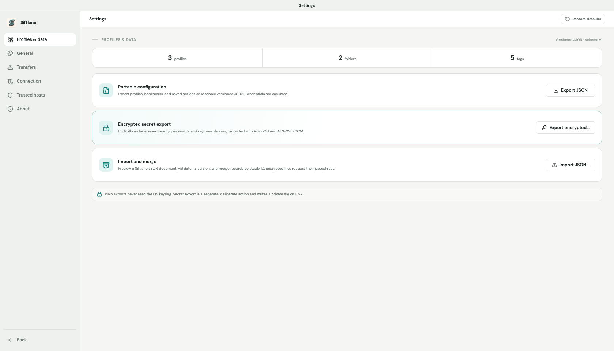

Plain exports never read the OS keyring and contain no passwords or private-key passphrases.
Choosing **Export encrypted…** is a separate action that requests a new passphrase, reads only the
saved credentials selected by profile authentication, and protects the secret payload with
Argon2id and AES-256-GCM. Siftlane does not store or recover the export passphrase.

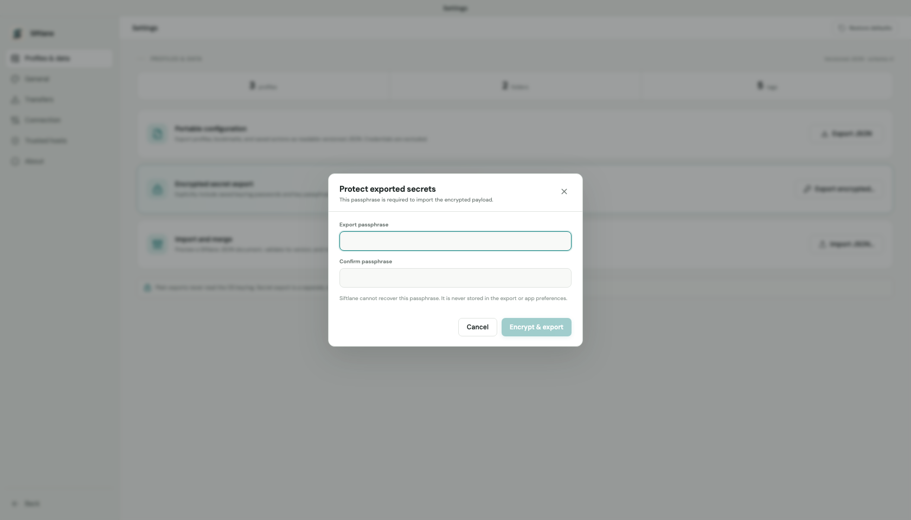

## Project structure

Siftlane is a Cargo workspace with a Tauri desktop shell and a React frontend. Protocol-independent transfer logic lives in reusable Rust crates, while native persistence and IPC commands stay in the Tauri application layer.

```text
.
├── crates/
│   ├── siftlane-core/       # Shared models, errors, filesystem traits, and transfer state machine
│   ├── siftlane-sftp/       # russh/russh-sftp implementation and SSH host-key verification
│   └── siftlane-ftp/        # FTP and explicit FTPS implementation
├── src/                     # React UI, Zustand store, typed IPC client, and browser demo
│   ├── lib/
│   └── test/
├── src-tauri/               # Tauri commands, SQLite storage, keyring, sessions, and transfers
│   ├── capabilities/
│   └── src/
├── docs/                    # Architecture, threat model, and screenshots
├── index.html               # Vite entry document
├── package.json             # Frontend and desktop development scripts
├── Cargo.toml               # Rust workspace and shared dependency versions
├── vite.config.ts           # Vite configuration
└── tsconfig*.json           # TypeScript project configuration
```

Key boundaries:

- `crates/siftlane-core` contains transport-neutral domain logic so future protocols can reuse the transfer queue.
- `crates/siftlane-sftp` and `crates/siftlane-ftp` adapt the core filesystem interface to their respective protocols.
- `src-tauri` exposes native functionality through Tauri IPC and handles SQLite, OS keyring access, sessions, and transfer execution.
- `src` renders the desktop UI and provides a browser-only demo adapter for fast frontend work.

## Development

Prerequisites:

- Rust stable (MSRV 1.88)
- Node.js 22 or newer
- pnpm 11
- The [Tauri system prerequisites](https://v2.tauri.app/start/prerequisites/) for your OS

```sh
npm install
npm run tauri dev
```

For frontend-only development, run `npm run dev`. It starts in the same empty first-run state as a fresh desktop install. Run `npm run dev:demo` (or open `/?demo=1`) when you intentionally want the populated UI showcase. Browser connections are simulated; use `npm run tauri dev` to exercise real SFTP and native persistence.

## Quality checks

```sh
npm run build
npm test
cargo fmt --all -- --check
cargo clippy --workspace --all-targets -- -D warnings
cargo test --workspace
```

## Security and architecture

- `crates/siftlane-core`: protocol-neutral models, errors, filesystem trait, and transfer state machine
- `crates/siftlane-sftp`: `russh`/`russh-sftp` adapter and strict host-key verification
- `src-tauri`: commands, SQLite persistence, OS keyring integration, sessions, and transfer runner
- `src`: React UI, Zustand state, typed IPC boundary, and browser demo adapter

SQLite never stores credentials. Keyring entries use the service name `app.siftlane.desktop`, keyed by connection UUID. Uploads and downloads first write uniquely named partial files and use a backup/rename commit sequence to reduce the chance of replacing a destination with incomplete data. External-editor working copies live under one process-owned temporary root, use `0700` directories and `0600` files on Unix, and are recursively removed when app state shuts down.

### macOS development Keychain access

The macOS Keychain associates an item's access rule with the code signature of the executable that created it. An ad-hoc Rust development build receives a new signature hash after every rebuild, which makes Keychain ask for the login password again. `npm run tauri dev` now signs the Siftlane debug executable with the first available **Apple Development** signing identity, or a local **Siftlane Development** identity, so the rule remains stable across rebuilds. Set `SIFTLANE_DEV_SIGNING_IDENTITY` to a specific identity or certificate hash when more than one is available.

The first access after enabling this may still require one confirmation. Choose **Always Allow**. Existing credentials created by ad-hoc builds can retain their old hash-based rules; delete only the affected `app.siftlane.desktop` entry in Keychain Access and save that connection password again to recreate it with the stable rule.

Touch ID is not available through the legacy macOS Keychain API used by development builds. It requires the protected-data Keychain plus a provisioned, sandboxed macOS application. Until the release signing/provisioning setup is in place, the secure expected experience is no prompt after the one-time **Always Allow**, rather than a Touch ID prompt on every connection.

If you do not have a paid Apple Developer account, create a local signing identity in **Keychain Access → Certificate Assistant → Create a Certificate…**. Name it `Siftlane Development`, choose **Self-Signed Root Certificate**, choose **Code Signing** as the certificate type, and keep the generated private key in your login keychain. Then double-click the certificate under **login → My Certificates**, expand **Trust**, set **Code Signing** to **Always Trust**, and close the dialog (approve with your Mac password if asked). Verify it with `security find-identity -v -p codesigning`, then run `npm run tauri dev`. If it is not selected automatically, set `SIFTLANE_DEV_SIGNING_IDENTITY` to the certificate hash printed by that command.

Protected-file operations use the existing SSH identity (including private keys and SSH agents) for connection authentication, then check the remote account's sudo policy separately. Siftlane probes `sudo -n` for `NOPASSWD` access and otherwise prompts for the account's sudo password for the immediate read, write, create, or delete operation; it never stores or logs that password. A terminal that does not prompt may be using a cached sudo timestamp, which is not shared with Siftlane's non-interactive SSH channel. Server administrators must configure an appropriate `NOPASSWD` policy when passwordless file operations are required.

See [CONTRIBUTING.md](CONTRIBUTING.md), [SECURITY.md](SECURITY.md), and [docs/architecture.md](docs/architecture.md) for more detail.
Release maintainers should also follow [docs/integration-testing.md](docs/integration-testing.md)
and [docs/release-security.md](docs/release-security.md).

## License

Licensed under either of Apache License 2.0 or MIT, at your option.
