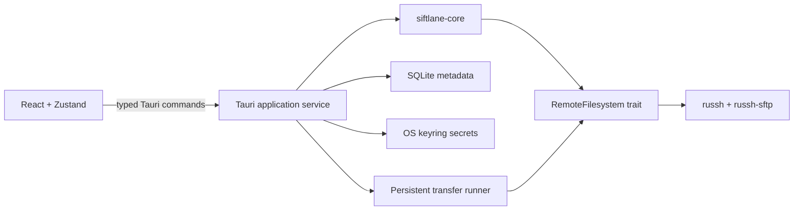

# Architecture

Siftlane uses a thin React presentation layer over a Rust application service. Tauri commands are the only UI/backend boundary.

## Connection lifecycle

1. Load a profile from SQLite and its optional credential from the OS keyring.
2. Open SSH and classify the observed public host key as trusted, unknown, or changed.
3. Reject unknown/changed keys and return a fingerprint challenge to the UI.
4. After explicit trust, reconnect and authenticate.
5. Keep the live client in memory under a random session UUID; no session material is persisted.

## Transfer guarantees

Jobs are persisted after state/progress changes. A running job discovered at startup becomes `interrupted`. When its profile reconnects, Siftlane requeues it and continues from the existing unique partial file. Final promotion uses rename, with a temporary destination backup for overwrites and rollback if promotion fails.

The queue state machine is deliberately transport-neutral. FTP/FTPS can implement `RemoteFilesystem` later without rewriting UI or scheduling code.
