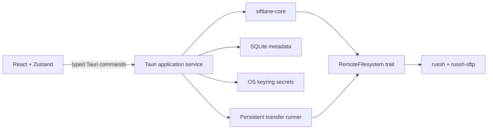

# Architecture

Siftlane uses a thin React presentation layer over a Rust application service. Tauri commands are the only UI/backend boundary.

```mermaid
flowchart LR
  UI["React + Zustand"] -->|"typed Tauri commands"| APP["Tauri application service"]
  APP --> CORE["siftlane-core"]
  APP --> DB["SQLite metadata"]
  APP --> KEYRING["OS keyring secrets"]
  CORE --> FS["RemoteFilesystem trait"]
  FS --> SFTP["russh + russh-sftp"]
  APP --> QUEUE["Persistent transfer runner"]
  QUEUE --> FS
```

## Connection lifecycle

1. Load a profile from SQLite and its optional credential from the OS keyring.
2. Open SSH and classify the observed public host key as trusted, unknown, or changed.
3. Reject unknown/changed keys and return a fingerprint challenge to the UI.
4. After explicit trust, reconnect and authenticate.
5. Keep the live client in memory under a random session UUID; no session material is persisted.

## Transfer guarantees

Jobs are persisted after state/progress changes. A running job discovered at startup becomes
`interrupted`. A fair scheduler enforces live global and per-endpoint limits. Retryable failures use
bounded exponential backoff and reconnect from the OS keyring when possible. Conflict decisions can
apply to a whole directory-transfer batch, including collision-free Keep Both names. Before final
promotion, Siftlane performs SHA-256 read-back verification for files up to 64 MB and size
verification for larger files. Final promotion uses rename, with a temporary destination backup for
overwrites and rollback if promotion fails.

The queue state machine is deliberately transport-neutral. FTP/FTPS can implement `RemoteFilesystem` later without rewriting UI or scheduling code.

## Diagnostics

Diagnostics are an explicit opt-in preference and are off by default. A shared atomic gate lets the
file logger react immediately when the setting changes without restarting the app. Only events sent
to the dedicated diagnostics target can reach disk; dependency logs and ordinary application log
messages are rejected by the file target.

Diagnostic events describe controlled operation metadata such as app/platform version, transport
and authentication kinds, success/failure outcomes, retry counts, and `ErrorCode` values. Random
per-launch session IDs and per-operation IDs correlate connection, search, and transfer stages;
finished events include elapsed milliseconds. They do not format profiles, paths, user-entered
strings, `AppError` messages/details, commands, or file contents.

A private lifecycle marker identifies an earlier unclean exit. Clean shutdown removes it, while the
panic hook records only an allowlisted component, source line, and coarse lifecycle phase—never the
panic payload or a source path. Retention is capped at four 256 KB files, and Settings exposes
reveal and clear actions.

Support bundle review snapshots the retained diagnostic files in bounded memory, so the exported
ZIP contains exactly what the user reviewed even if logging continues afterward. The bundle adds a
JSON privacy manifest with schema/app/platform metadata, file sizes, and SHA-256 checksums. It does
not read configuration, SQLite, keychain, arbitrary log-directory entries, or any user files.
Exports are assembled in a private temporary file and atomically persisted outside the log
directory.

Startup validates the app-owned log directory and files before the logger opens them, restricts Unix
permissions, removes unsafe links and stale collision backups, and migrates away the legacy
unfiltered log. Preference writes are serialized so rapid opt-in changes cannot reorder on disk.
